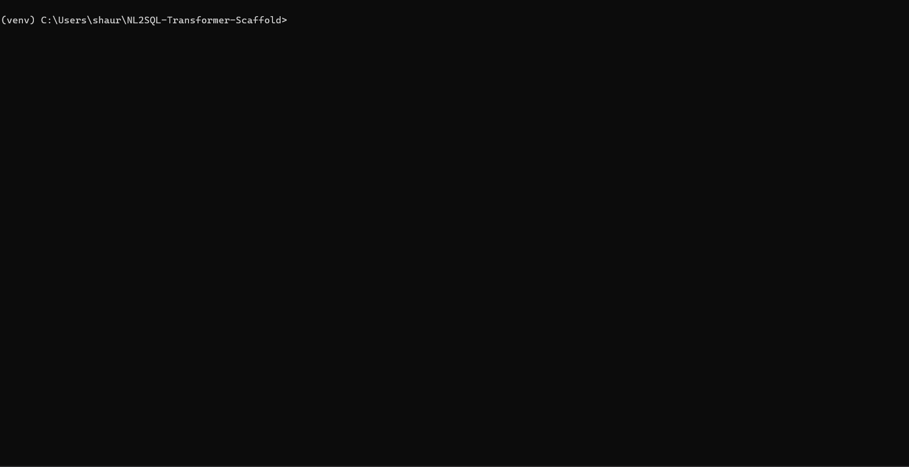

# Transqlate-Phi4

Transqlate is an end-to-end natural language to SQL pipeline powered by a fine-tuned Phi-4 Mini LLM. This project enables users—both technical and non-technical—to generate complex, schema-aware SQL queries directly from English instructions, with a production-ready command-line interface (CLI) and a modular schema retrieval (RAG) pipeline. The project covers everything from model fine-tuning and schema graph engineering to professional packaging and distribution on PyPI.

## Overview

Transqlate is designed for seamless, safe, and accurate English-to-SQL translation over arbitrary relational databases. It incorporates best practices from LLM research and modern MLOps:

* **Fine-tuning**: Trains a small LLM (Phi-4 Mini) for high-accuracy, schema-aware SQL generation using QLoRA and the Unsloth library, leveraging cloud GPUs for scalable training.
* **Schema Retrieval (RAG)**: Integrates a schema retrieval pipeline to provide the model with only relevant database context, supporting large and complex databases without exceeding model context limits.
* **Production-Ready CLI**: Offers a robust and user-friendly CLI for interactive query generation, schema exploration, and safe SQL execution with explicit guardrails against dangerous queries.
* **PyPI Distribution**: The CLI tool is pip-installable and can be run on any system with Python 3.8+.

---

## Project Structure

* `src/` — All Python code, including CLI, schema pipeline, and inference logic.

  * `transqlate/` — Main Python package (pip installable)

    * `cli/` — CLI application entry point
    * `schema_pipeline/` — Schema extraction, formatting, and RAG modules
    * `inference.py` — Model inference code
  * (other development or training scripts remain in `src/` but are not packaged)
* `model/` — Fine-tuned model checkpoints (not included in pip package)
* `dist/` — Built wheel and source distributions (created after packaging)
* `requirements.txt`, `pyproject.toml` — Dependency and packaging config

---

## Features

* **Schema-Aware NL→SQL Generation**: Accurately translates English questions to SQL for arbitrary databases, leveraging dynamic schema context retrieval.
* **Chain-of-Thought Reasoning**: Produces both reasoning steps and final SQL for transparency and error analysis.
* **Safe Execution Guardrails**: Confirms user intent before running any query that alters data or schema; all data-altering commands require explicit approval.
* **Interactive CLI**: Supports live query, schema browsing, command history, dynamic DB switching, and error-tolerant UX.
* **Spreadsheet/CSV Mode**: Load Excel or CSV files as a temporary SQLite database and export results back to spreadsheets.
* **Automatic Dialect Conversion**: Generated SQLite-style SQL is converted to PostgreSQL, MySQL, SQL Server, or Oracle syntax before execution.
* **Cloud-Scale Fine-Tuning**: All model training conducted on GCP with Unsloth’s QLoRA for memory- and compute-efficient LLM fine-tuning.
* **Modern Packaging**: Distributed as a pip-installable Python package with a single CLI entry point.

---

## Model Fine-Tuning on GCP

Transqlate-Phi4 is built on Microsoft’s Phi-4 Mini-Instruct model, fine-tuned for NL→SQL with chain-of-thought reasoning. The pipeline:

1. **Dataset Preparation**: Training and validation datasets in JSONL format, with paired NL, schema, chain-of-thought, and SQL fields.

2. **Training Script**: Run using Unsloth’s QLoRA implementation on GCP GPUs (L4 recommended):

   ```bash
   pip install -r requirements.txt
   python src/finetune.py
   ```

3. **Output**: Model checkpoints are saved to `model/phi4-transqlate-qlora/` for later inference and packaging.

---

## Model Checkpoints

The fine-tuned Transqlate-Phi4 model weights are available on Hugging Face Hub:

[https://huggingface.co/Shaurya-Sethi/transqlate-phi4](https://huggingface.co/Shaurya-Sethi/transqlate-phi4)

You can load the model for inference in Python using:

```python
from transformers import AutoModelForCausalLM, AutoTokenizer

model_id = "Shaurya-Sethi/transqlate-phi4"
tokenizer = AutoTokenizer.from_pretrained(model_id)
model = AutoModelForCausalLM.from_pretrained(model_id)
```

---

## Schema Retrieval and RAG Pipeline

The schema retrieval (RAG) pipeline is designed to provide the LLM with only the most relevant tables, columns, and relationships for each query. This ensures scalability to large databases and high accuracy by avoiding context overload.

* **Schema Extractor**: Connects to SQLite, PostgreSQL, MySQL, and other databases to extract full schema graphs.
  * Quoted identifiers are preserved: if a table or column name is wrapped in
    quotes, the extractor keeps its exact case (Postgres lowercases unquoted
    names, Oracle uppercases them).
* **Formatter**: Converts extracted schema to a compact, model-friendly format.
* **RAG Selector**: Selects and injects only the necessary schema subset for each prompt, using similarity and context rules.

This modular architecture is fully integrated into both training and inference pipelines.

---

## Production CLI & Usage

The CLI tool, installed via pip, allows you to interactively generate, review, and safely execute SQL over any supported database.

### **Installation (via PyPI)**

```bash
pip install transqlate
```

For spreadsheet mode you will also need `pandas` and `openpyxl`:

```bash
pip install pandas openpyxl
```

### **Usage**

Start the interactive CLI:

```bash
transqlate --interactive
```

On first run, the CLI will download the `all-MiniLM-L6-v2` sentence embedding
model. The model is cached locally so subsequent runs are offline and start
instantly. If you need to pre-download the embeddings (e.g. on an offline
machine), run:

```bash
python -c "from sentence_transformers import SentenceTransformer; SentenceTransformer('all-MiniLM-L6-v2')"
```

Or run a one-off query:

```bash
transqlate -q "Which customers made purchases in March?" --db-path path/to/your.db
```



#### **CLI Features**

* Interactive natural language to SQL translation
* Safe execution with confirmation for data-altering queries
* Dynamic schema exploration (`:show schema`)
* Automatic SQL dialect fixes for Postgres, MySQL, SQL Server and Oracle
* Automatic schema qualification for SQL Server, Oracle and PostgreSQL when tables live outside their default schemas
* Command history, example prompts, and connection switching
* Spreadsheet mode with `:export` command to save query results

#### Schema Qualification Examples

```
-- Before (fails on SQL Server)
SELECT TOP 5 Product FROM Products;

-- After (works)
SELECT TOP 5 Product FROM Sales.Products;

-- PostgreSQL example
SELECT * FROM users JOIN orders ON users.id=orders.user_id;
-- becomes
SELECT * FROM auth.users JOIN sales.orders ON users.id=orders.user_id;

-- Oracle example
SELECT * FROM Employees;  -- employees in HR schema
-- becomes
SELECT * FROM HR.Employees;
```

### Troubleshooting Oracle Schema Extraction

The Oracle extractor pulls tables from `USER_TABLES`. If your schema
contains Oracle demo or system tables, they will appear in `:show schema`
and in NL→SQL prompts. You can hide them by providing a list of prefixes
to ignore:

```python
ex = get_schema_extractor(
    "oracle",
    host="HOST",
    user="USER",
    password="PW",
    service_name="SERVICE",
    ignore_table_prefixes=["MVIEW$_", "APEX$_", "DEMO_"]
)
```

Drop the tables or customise the list as needed to keep the schema view
clean.

---

## Development & Contribution

* To build and test locally:

  ```bash
  pip install -e .
  transqlate --help
  ```
* Training, fine-tuning, and research scripts remain in `src/` but are not included in the published package.

---

## License

Distributed under the MIT License. See `LICENSE` for details.

---

## Citation

If you use or extend this work, please cite this repository, Microsoft’s Phi-4 model, and the [SynSQL-2.5M dataset](https://huggingface.co/datasets/seeklhy/SynSQL-2.5M) by Seeklhy et al.

The SynSQL-2.5M dataset was used as the primary source for building a large, high-quality training set for natural language to SQL translation. We encourage users to explore the original dataset and give the authors a star or cite their work as appropriate. Your feedback helps support further open research in this area.

This project’s fine-tuning was made possible by the generous research credits from Google Cloud Platform (GCP), which provided the resources for large-scale model training.

---

## Contact

For questions, feature requests, or collaborations, please contact:

Shaurya Sethi
[Hugging Face: Shaurya-Sethi](https://huggingface.co/Shaurya-Sethi)
[Project Model Page](https://huggingface.co/Shaurya-Sethi/transqlate-phi4)
Email: [shauryaswapansethi@gmail.com](mailto:shauryaswapansethi@gmail.com)

Feel free to open an issue or pull request on the GitHub repository for bugs, improvements, or contributions.
